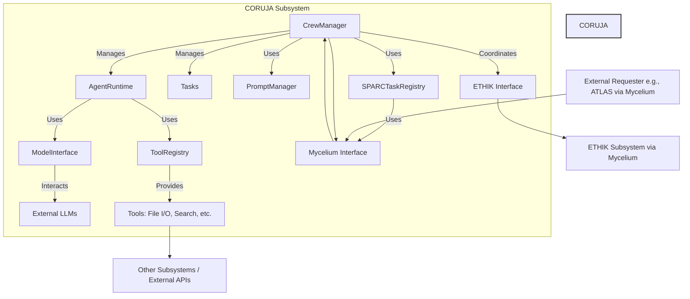

---
metadata:
  author: "EGOS AI Assistant (Roo)"
  backup_required: true
  category: ARCHITECTURE_DOCUMENTATION
  description: "High-level architecture design for the CORUJA subsystem, responsible for AI orchestration."
  documentation_quality: 0.2 # Initial draft
  encoding: utf-8
  ethical_validation: false
  last_updated: '2025-04-14' # Current date
  related_files:
    - subsystems/CORUJA/README.md
    - subsystems/MYCELIUM/README.md
    - subsystems/ETHIK/README.md
    - subsystems/KOIOS/README.md
    - .cursor/rules/sparc_orchestration.mdc
    - .cursor/rules/api_design_contracts.mdc
  required: true # Core subsystem architecture
  review_status: draft
  security_level: 0.6
  subsystem: "CORUJA"
  type: documentation
  version: '0.1.0' # Initial version
  windows_compatibility: true
---

# Architecture Design: CORUJA Subsystem

**Version:** 0.1.0
**Status:** Draft

## 1. Introduction & Goals

*   **Purpose:** This document outlines the internal architecture of the CORUJA subsystem. CORUJA is responsible for managing interactions with external AI models (LLMs), orchestrating AI agents and crews, managing prompts (PDDs), and implementing the SPARC methodology for complex task execution within EGOS.
*   **Goals:**
    *   Provide a standardized interface for interacting with diverse LLMs.
    *   Enable the creation and management of specialized AI agents and crews.
    *   Orchestrate complex tasks using the SPARC methodology via Mycelium.
    *   Integrate seamlessly with ETHIK for ethical validation.
    *   Adhere to KOIOS standards for logging and configuration.
    *   Support flexible tool usage by agents.
    *   Decouple AI interaction logic from core application logic.
*   **Non-Goals:**
    *   Implementing the underlying LLM inference logic.
    *   Defining specific ethical rules (handled by ETHIK).
    *   Managing persistent user data (handled by CRONOS or other subsystems).

## 2. High-Level Overview

CORUJA acts as the central AI brain. It receives task requests (often SPARC tasks via Mycelium), manages prompts, selects appropriate AI models and agents, coordinates their execution (including tool usage and ETHIK checks), and returns results.



*   **Key Principles:** Event-driven (via Mycelium), Agent-based architecture, Modular, Rule-based (SPARC & ETHIK integration).

## 3. Component Breakdown

*   **`CrewManager` (`core/crew_manager.py`):**
    *   **Responsibility:** Orchestrates the entire process of executing a task or a series of tasks using a crew of agents. Acts as the main entry point for requests (often via Mycelium).
    *   **Interfaces:** Handles incoming Mycelium messages (e.g., `sparc.task.create`), interacts with `SPARCTaskRegistry`, `PromptManager`, `AgentRuntime`, and `ETHIK`. Publishes results via Mycelium.
    *   **Dependencies:** `SPARCTaskRegistry`, `PromptManager`, `AgentRuntime`, `ETHIK` (interface), `Mycelium` (interface), `KoiosLogger`.
*   **`SPARCTaskRegistry` (`core/sparc_registry.py`):**
    *   **Responsibility:** Manages the lifecycle and state of SPARC tasks within CORUJA. Tracks dependencies and facilitates delegation.
    *   **Interfaces:** Methods like `register_task`, `update_task_status`, `get_task`, `get_dependencies`, `delegate_via_mycelium`.
    *   **Dependencies:** `Mycelium` (interface), `KoiosLogger`.
*   **`AgentRuntime` (`core/agent_runtime.py`):**
    *   **Responsibility:** Represents an executing instance of an AI agent. Handles the interaction cycle for a single task assigned to it: prompt generation, LLM invocation, tool execution, response parsing.
    *   **Interfaces:** Executes a task based on input from `CrewManager`. Uses `ModelInterface`, `ToolRegistry`, `PromptManager`.
    *   **Dependencies:** `ModelInterface`, `ToolRegistry`, `PromptManager`, `KoiosLogger`.
*   **`ModelInterface` (`interfaces/model_interface.py`):**
    *   **Responsibility:** Provides a standardized, abstract way to interact with different LLMs. Handles model selection based on task type (reasoning vs. implementation).
    *   **Interfaces:** Abstract base class with methods like `invoke_llm(prompt, config)`. Concrete implementations for specific providers (e.g., OpenAI, Anthropic, potentially using LiteLLM).
    *   **Dependencies:** LLM provider libraries, `ConfigurationLoader`, `KoiosLogger`.
*   **`ToolRegistry` (`core/tool_registry.py`):**
    *   **Responsibility:** Manages the definition and execution of tools available to agents.
    *   **Interfaces:** Methods like `register_tool`, `get_tool`, `execute_tool(tool_name, args)`.
    *   **Dependencies:** Tool implementation modules/classes, `KoiosLogger`.
*   **`PromptManager` (`core/prompt_manager.py`):**
    *   **Responsibility:** Loads, parses, formats, and retrieves prompts (PDDs) based on requests from `CrewManager` or `AgentRuntime`. Handles variable injection.
    *   **Interfaces:** Methods like `get_prompt(prompt_name, variables)`.
    *   **Dependencies:** PDD storage mechanism (e.g., file system access via CRONOS interface), `KoiosLogger`.
*   **`ConfigurationLoader` (`config/loader.py`):**
    *   **Responsibility:** Securely loads configuration, including API keys, model settings, Mycelium topics, etc.
    *   **Interfaces:** Methods like `get_config()`, `get_api_key(provider_name)`.
    *   **Dependencies:** Configuration storage (e.g., files, environment variables), `KoiosLogger`.

*   **Component Relationships (Class Diagram):**

    ```mermaid
    classDiagram
        class CrewManager {
            +run_crew()
            +handle_sparc_request()
            +coordinate_ethik_check()
        }
        class SPARCTaskRegistry {
            +register_task()
            +update_task_status()
            +delegate_via_mycelium()
        }
        class AgentRuntime {
            +execute_task()
        }
        class ModelInterface {
            <<Interface>>
            +invoke_llm()
        }
        class ToolRegistry {
            +register_tool()
            +execute_tool()
        }
        class PromptManager {
            +get_prompt()
        }
        class ConfigurationLoader {
            +get_config()
            +get_api_key()
        }
        class MyceliumInterface {
            <<Interface>>
            +publish()
            +subscribe()
        }
        class EthikInterface {
            <<Interface>>
            +request_validation()
            +request_sanitization()
        }
        class KoiosLogger {
            <<Interface>>
            +info()
            +error()
        }

        CrewManager --> SPARCTaskRegistry : Uses
        CrewManager --> AgentRuntime : Manages
        CrewManager --> PromptManager : Uses
        CrewManager --> EthikInterface : Coordinates
        CrewManager --> MyceliumInterface : Uses
        CrewManager --> KoiosLogger : Uses

        SPARCTaskRegistry --> MyceliumInterface : Uses
        SPARCTaskRegistry --> KoiosLogger : Uses

        AgentRuntime --> ModelInterface : Uses
        AgentRuntime --> ToolRegistry : Uses
        AgentRuntime --> PromptManager : Uses
        AgentRuntime --> KoiosLogger : Uses

        ModelInterface --> ConfigurationLoader : Uses
        ModelInterface --> KoiosLogger : Uses

        ToolRegistry --> KoiosLogger : Uses
        ToolRegistry --> "*" ToolImplementation : Executes

        PromptManager --> KoiosLogger : Uses
        PromptManager --> "*" PDD_Storage : Reads

        ConfigurationLoader --> KoiosLogger : Uses
    ```

## 4. Data Models & Storage

*   **Key Data Structures (Pydantic Models):**

    ```python
    # In subsystems/CORUJA/schemas/models.py (Conceptual Location)
    from pydantic import BaseModel, Field
    from typing import List, Dict, Any, Optional

    class AgentConfig(BaseModel):
        agent_id: str
        role: str
        goal: str
        backstory: Optional[str] = None
        llm_config: Dict[str, Any] # e.g., {'provider': 'openai', 'model': 'gpt-4o', 'temperature': 0.7}
        tools: List[str] = [] # List of tool names available to this agent

    class TaskDefinition(BaseModel):
        # Based on .cursor/rules/sparc_orchestration.mdc
        id: str = Field(..., description="Unique task identifier")
        type: str = Field(..., description="E.g., specification, architecture, implementation, testing")
        title: str
        description: str
        acceptance_criteria: List[str]
        inputs: Dict[str, Any]
        dependencies: List[str] = []
        metadata: Dict[str, Any] = {}
        expected_output_format: Optional[str] = None # Description or schema reference

    class SPARCTaskState(BaseModel):
        task_id: str
        status: str # e.g., pending, running, completed, failed, delegated
        current_phase: Optional[str] = None # e.g., specification, implementation
        result: Optional[Any] = None
        error_message: Optional[str] = None
        history: List[Dict[str, Any]] = [] # Log of state changes/actions

    class ToolDefinition(BaseModel):
        name: str
        description: str
        input_schema: Dict[str, Any] # JSON Schema for input arguments
        # Reference to the actual implementation function/class
        implementation_ref: str
    ```
*   **Data Storage:**
    *   SPARC task states (`SPARCTaskRegistry`) might require persistence (e.g., Redis, simple file/DB) for longer-running workflows or recovery. To be determined based on CRONOS capabilities.
    *   PDDs are likely stored on the file system, managed via KOIOS/CRONOS.
    *   Configuration is loaded via `ConfigurationLoader`.
*   **Data Flow:** Primarily event-driven via Mycelium for external interaction. Internally, data objects (like `TaskDefinition`, `AgentConfig`) are passed between components.

## 5. Interaction Patterns & Communication

*   **Communication Style:** Primarily asynchronous messaging via Mycelium for inter-subsystem communication. Internal communication is via direct method calls between components.
*   **Key Interaction Flows:**
    *   **SPARC Task Execution (Detailed Flow):**
        ```mermaid
        sequenceDiagram
            participant Requester
            participant Mycelium
            participant CrewManager
            participant SPARCTaskRegistry
            participant AgentRuntime
            participant PromptManager
            participant ModelInterface
            participant ToolRegistry
            participant ETHIK

            Requester->>Mycelium: Publish(sparc.task.create, TaskDefinition)
            Mycelium->>CrewManager: Receive TaskDefinition
            CrewManager->>SPARCTaskRegistry: register_task(TaskDefinition)
            SPARCTaskRegistry-->>CrewManager: Task ID
            CrewManager->>AgentRuntime: assign_task(TaskDefinition, AgentConfig)

            AgentRuntime->>PromptManager: get_prompt(prompt_name, variables)
            PromptManager-->>AgentRuntime: Formatted Prompt

            opt Pre-LLM ETHIK Check
                CrewManager->>Mycelium: Publish(request.ethik.validate, Prompt/Context)
                Mycelium->>ETHIK: Deliver Validation Request
                ETHIK-->>Mycelium: Publish(response.ethik.validate, Result)
                Mycelium-->>CrewManager: Deliver Validation Result
                alt Validation Failed
                    CrewManager->>SPARCTaskRegistry: update_task_status(Task ID, 'failed', Error)
                    CrewManager->>Mycelium: Publish(sparc.task.results.{Task ID}, Error)
                    Mycelium->>Requester: Receive Error Result
                    Note right of CrewManager: Halt Execution
                end
            end

            AgentRuntime->>ModelInterface: invoke_llm(Formatted Prompt, LLM Config)
            ModelInterface-->>AgentRuntime: LLM Response (may include tool calls)

            loop If LLM requests tool use
                AgentRuntime->>ToolRegistry: execute_tool(tool_name, args)
                opt ETHIK Check for Tool Use
                     CrewManager->>Mycelium: Publish(request.ethik.validate, Tool Call Details)
                     Mycelium->>ETHIK: Deliver Validation Request
                     ETHIK-->>Mycelium: Publish(response.ethik.validate, Result)
                     Mycelium-->>CrewManager: Deliver Validation Result
                     alt Validation Failed
                         Note right of AgentRuntime: Handle Tool Failure / Inform LLM
                     end
                end
                ToolRegistry-->>AgentRuntime: Tool Result
                AgentRuntime->>ModelInterface: invoke_llm(Prompt + Tool Result, LLM Config)
                ModelInterface-->>AgentRuntime: Updated LLM Response
            end

            AgentRuntime-->>CrewManager: Final Task Result

            opt Post-Result ETHIK Check
                CrewManager->>Mycelium: Publish(request.ethik.validate, Final Result)
                Mycelium->>ETHIK: Deliver Validation Request
                ETHIK-->>Mycelium: Publish(response.ethik.validate, Result)
                Mycelium-->>CrewManager: Deliver Validation Result
                alt Validation Failed
                    Note right of CrewManager: Mark Result as Invalid / Handle
                end
            end

            CrewManager->>SPARCTaskRegistry: update_task_status(Task ID, 'completed', Final Result)
            CrewManager->>Mycelium: Publish(sparc.task.results.{Task ID}, Final Result)
            Mycelium->>Requester: Receive Final Result
        ```
*   **API Contracts:** Relies on ETHIK API contracts defined in `subsystems/ETHIK/docs/API.md` and potentially contracts from other subsystems if tools interact directly. Internal contracts are the Pydantic models defined above.

## 6. Security Considerations

*   **Authentication/Authorization:** Mycelium security context (if implemented) or application-level checks in `CrewManager` might be needed. Tool execution needs careful permissioning.
*   **Data Security:**
    *   Sensitive data within prompts or results requires ETHIK sanitization before logging or sending to less secure contexts.
    *   Input validation on data received via Mycelium.
*   **Secrets Management:** API keys for LLMs handled strictly by `ConfigurationLoader` and `ModelInterface`, never exposed to agents directly unless explicitly required by a secure tool.
*   **Tool Security:** Tools accessing external resources or executing code must be carefully vetted and potentially sandboxed. ETHIK validation should be applied to tool usage.

## 7. Deployment & Scalability

*   **Deployment Strategy:** Likely deployed as a standard Python service (e.g., within a Docker container).
*   **Scalability:** Can be scaled horizontally by running multiple instances of the CORUJA service, relying on Mycelium for load distribution. The `SPARCTaskRegistry` might need a shared persistent backend (like Redis) if state needs to be coordinated across instances. `ModelInterface` interactions are stateless.

## 8. Design Decisions & Alternatives Considered

*   **Agent Framework:** Chose a custom, simpler agent/crew model initially over complex frameworks like LangGraph or AutoGen for tighter integration with EGOS principles (SPARC, ETHIK, Mycelium). Can revisit if more complex agent interactions are needed.
*   **SPARC Registry Persistence:** Initially assuming in-memory state for `SPARCTaskRegistry`, but designed to allow adding persistence later if required.

## 9. Open Questions & Future Considerations

*   Detailed error handling and retry logic for LLM calls and Mycelium communication.
*   Persistence strategy for `SPARCTaskRegistry`.
*   Implementation details for `ToolRegistry` security and execution environment.
*   Advanced agent memory management.
*   Integration with monitoring/observability platforms (Langfuse, AgentOps).
*   Refining model selection logic based on performance metrics.

---
✧༺❀༻∞ EGOS ∞༺❀༻✧